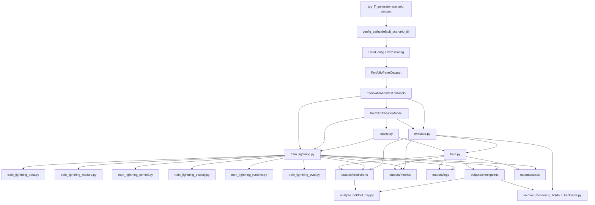

# Portfolio Attention `src` 架構技術文檔

這份文件是 `portfolio_attention/src` 的開發者導向架構說明，聚焦目前程式的真實資料流、模組責任、輸入輸出、依賴關係、輸出 artifact 與已知邊界。本文不重寫完整數學推導，而是把現有 `src` 實作如何消費 scenario parquet、建資料集、訓練模型、評估與重建回測 artifact 講清楚。

## 1. 專案定位

`portfolio_attention` 不是資料生成器；它是使用 `toy_ff_generator` 產出的 scenario parquet 作為輸入，建立 scenario-aware 資料集，訓練投資組合模型，並輸出 checkpoint、metrics、predictions、status 與 monitoring holdout backtest artifact。

目前預設資料來源由 `config_paths.default_scenario_dir(...)` 決定：

- `toy_ff_generator/outputs/data v3/<state>`

這表示 `portfolio_attention` 與 `toy_ff_generator` 在資料路徑層面有直接耦合。

## 2. 架構總覽

整體可拆成五層：

- 設定層：`config.py`、`config_paths.py`、`config_validation.py`
- 資料層：`dataset.py`
- 模型與損失層：`model.py`、`losses.py`
- 訓練 / 評估層：`train.py`、`evaluate.py`
- Lightning 拆分 runtime 層：`train_lightning.py` 與 `train_lightning_*`

此外，`src` 根目錄下還有兩支分析 / 修復腳本：

- `analyze_holdout_day.py`
- `recover_monitoring_holdout_backtests.py`

### 2.1 套件公開入口

`src/portfolio_attention/__init__.py` 目前對外暴露的主要 public surfaces 為：

- `DataConfig`
- `ModelConfig`
- `PathsConfig`
- `TrainConfig`
- `PortfolioPanelDataset`
- `parse_panel_dimensions`
- `PortfolioAttentionModel`
- `return_loss`
- `sharpe_loss`

這些是最接近套件 API 的穩定表面；`train.py`、`train_lightning.py`、`evaluate.py` 則更像是內部但實務上重要的 CLI entrypoints。

### 2.2 主流程與依賴圖

### 2.3 三條主線

這個專案的核心不只一條 pipeline，而是三條相互銜接的主線：

1. scenario-aware dataset / preprocessing 主線
2. 原生 PyTorch model + train + evaluate 主線
3. Lightning / DDP runtime 拆模組主線

文件後續也會依這三條線來組織內容。

## 3. 主資料流

### 3.1 資料來源與 scenario 檔

每個 scenario parquet 檔對應一條完整市場路徑。`dataset.py` 會解析像這樣的檔名：

- `{state}_{N}_{T}_PL_{scenario_index}.parquet`

例如：

- `bull_4860_200_PL_17.parquet`

專案會從檔名解析：

- `state`
- `parsed_n`
- `parsed_t`
- `scenario_index`

### 3.2 資料集建構觀念

`DataConfig` 與 `PortfolioPanelDataset` 的核心前提是：

- 資料切分先發生在 scenario 層級
- 同一 scenario 不再切成 train / validation / test 的時間子段
- train 以 rolling windows 建樣本
- validation / test 保留整段 scenario 的可對齊時間區間

也就是說，這個專案是 scenario-aware split，而不是 scenario-internal time split。

### 3.3 特徵與 target

`dataset.py` 目前假設的主要欄位為：

- stock 維度特徵：`characteristic_1`、`characteristic_2`、`characteristic_3`、`price`
- market 維度特徵：`MKT`、`SMB`、`HML`
- target：優先使用 `return`；若缺失則由價格回推一期報酬

資料張量設計保留：

- scenario 維度
- time 維度
- stock 維度

模型與 loss 都建立在這個 layout 上，而不是先把 scenario/time 攤平成單一樣本軸。

### 3.4 價格正規化

`dataset.py` 目前支援的價格處理模式為：

- `none`
- `relative_to_anchor`

其中 `relative_to_anchor` 會把 context window 的價格欄位改寫成相對於該 window 第一個時間點 anchor price 的相對報酬形式。這個轉換只影響 stock feature 中的 `price` 通道，不改動其他欄位。

### 3.5 標準化與統計量

`dataset.py` 提供：

- `Standardizer`
- `RunningMoments`

它們的目的不是任意全資料標準化，而是協助只基於訓練資料的 train-segment rows 估計統計量，避免把 validation / test 資訊洩漏回訓練流程。

## 4. 模組架構說明

以下各節統一描述模組責任、主要介面、上游 / 下游關係與實作特點。

### 4.1 `config.py`

**模組責任**

- 定義主要 dataclass 設定物件
- 補 legacy checkpoint 中缺失的 model config 欄位
- 對設定物件提供輕量封裝與 property

**主要類別 / 函式**

- `PathsConfig`
- `DataConfig`
- `ModelConfig`
- `TrainConfig`
- `EvaluationConfig`
- `normalize_model_config_dict(...)`

**主要輸入 / 輸出**

- 輸入：Python 原生欄位值或 checkpoint metadata
- 輸出：已驗證的 dataclass 設定物件

**上游 / 下游**

- 上游：CLI、script、checkpoint 載入流程
- 下游：dataset、model、train、evaluate、Lightning runtime

**目前實作特點或限制**

- `DataConfig` 內建 scenario split、rolling window 與價格正規化設定
- `ModelConfig` 目前支援：
  - `stock_temporal_encoder_type`: `running_summary` / `causal_self_attention`
  - `stock_cross_sectional_encoder_type`: `mlp` / `self_attention`
  - `stock_id_representation_type`: `embedding` / `one_hot`
- `normalize_model_config_dict(...)` 會補舊 checkpoint 缺少的 `stock_temporal_dim`、`stock_id_representation_type`，並把 legacy `running_mean` 時間位置編碼正規化為 `none`

### 4.2 `config_paths.py`

**模組責任**

- 管理專案根目錄、輸出目錄與預設 scenario 來源路徑

**主要函式**

- `project_root()`
- `repo_root()`
- `default_scenario_dir(...)`
- `outputs_dir(...)`
- `checkpoints_dir(...)`
- `metrics_dir(...)`
- `logs_dir(...)`
- `predictions_dir(...)`
- `status_dir(...)`

**主要輸入 / 輸出**

- 輸入：`PathsConfig` 與 `state`
- 輸出：各種 `Path`

**上游 / 下游**

- 上游：`config.py`
- 下游：train / evaluate / scripts 的所有 I/O

**目前實作特點或限制**

- `default_scenario_dir(...)` 直接指向 `toy_ff_generator/outputs/data v3/<state>`
- `scenario_predictions_dir(...)` 目前以 `state_id.split("_")[0]` 決定 state-scoped 預測子目錄

### 4.3 `config_validation.py`

**模組責任**

- 驗證 dataclass 設定值是否合法
- 正規化部分 legacy metadata

**主要函式 / 常數**

- `validate_data_config(...)`
- `validate_model_config(...)`
- `validate_train_config(...)`
- `validate_evaluation_config(...)`
- `normalize_lookback_mode(...)`
- `LOOKBACK_MODE_ROLLING_WINDOW`
- `LEGACY_LOOKBACK_MODES`

**上游 / 下游**

- 上游：`config.py`
- 下游：整個專案設定層

**目前實作特點或限制**

- 會檢查 `state`、scenario path、rolling 參數、price normalization mode、seed、batch size
- 會把 `time_positional_encoding_type="running_mean"` 正規化為 `none`
- 仍保留 legacy lookback mode 常數，供 evaluate / analysis / refresh 路徑處理舊 metadata

### 4.4 `dataset.py`

**模組責任**

- 載入 scenario parquet
- 驗證 stock/time grid 對齊
- 建立 train / validation / test datasets
- 提供特徵轉換、價格 normalization、標準化與 rolling-window 切片

**主要類別 / 函式**

- `PortfolioPanelDataset`
- `ScenarioSegmentDataset`
- `RollingTrainWindowDataset`
- `ScenarioFileRecord`
- `ScenarioSegmentRecord`
- `ScenarioDatasetMetadata`
- `LoadedScenarioArrays`
- `PrecomputedTrainScenarioArrays`
- `parse_panel_dimensions(...)`
- `parse_scenario_file_info(...)`
- `transform_stock_features_for_context(...)`
- `scale_stock_features_for_context(...)`

**主要輸入 / 輸出**

- 輸入：scenario parquet 檔、`DataConfig`
- 輸出：
  - train dataset：rolling windows
  - validation dataset：full-scenario records
  - test dataset：full-scenario records

**上游 / 下游**

- 上游：`DataConfig`
- 下游：`train.py`、`evaluate.py`、`train_lightning_data.py`、analysis / recovery scripts

**目前實作特點或限制**

- 會解析 parquet 檔名並核對 `N/T` metadata
- 會把 `t` label 解析成整數時間索引
- 會要求不同 scenario 共享一致的 stock universe / stock ordering / time ordering
- 若沒有 `return` 欄位，會從 `price` 回推出一期報酬
- train 走 rolling window；validation / test 保留全 scenario 的可對齊區間
- `rolling_train_dataset_mode` 支援 `lazy` / `eager`

### 4.5 `model.py`

**模組責任**

- 定義 scenario-aware 的投資組合模型
- 在 forward 中維持 `[S, T, N, ...]` 與 `[S, T, ...]` 的結構

**主要類別**

- `PortfolioAttentionModel`

**主要輸入 / 輸出**

- 輸入：
  - `x_stock`: `[S, T, N, F_stock]`
  - `x_market`: `[S, T, F_market]`
  - `stock_indices`: `[S, N]`
  - `target_returns`: `[S, T, N]`
- 輸出：
  - `stock_weights`: `[S, T, N]`
  - `cash_weight`: `[S, T]`
  - `portfolio_return`: `[S, T]`

**上游 / 下游**

- 上游：dataset / train / evaluate / LightningModule
- 下游：`losses.py`、`evaluate.py`

**目前實作特點或限制**

- 明確保留 scenario / time 結構，不在模型入口就攤平
- stock temporal branch 支援：
  - causal running summary
  - fixed-window causal self-attention
- cross-sectional branch 支援：
  - MLP scorer
  - stock self-attention scorer
- stock identity 支援：
  - learned embedding
  - fixed Gaussian code style 的 one-hot 替代表示
- market branch 目前是 linear projection 加 causal context 匯總

### 4.6 `losses.py`

**模組責任**

- 定義路徑型 portfolio loss / risk objective

**主要函式**

- `return_loss(...)`
- `sharpe_loss(...)`
- `differential_sharpe_loss(...)`
- `sortino_loss(...)`
- `max_drawdown_loss(...)`
- `cvar_loss(...)`
- `build_loss(...)`

**主要輸入 / 輸出**

- 輸入：`portfolio_returns`，形狀預期為 `[num_scenarios, time_steps]`
- 輸出：可供最小化的 scalar loss

**上游 / 下游**

- 上游：`train.py`、`train_lightning_module.py`
- 下游：optimizer / training loop

**目前實作特點或限制**

- `return_loss(...)` 目前預設使用 multiplicative terminal return，而不是單純平均一期報酬
- `sharpe_loss(...)` 在時間步不足或波動太小時會 fallback 到 `return_loss(...)`
- `build_loss(...)` 允許多種 alias，如 `return` / `terminalreturn`、`sr`、`mdd`

### 4.7 `evaluate.py`

**模組責任**

- 載入 checkpoint 做 holdout evaluation
- 生成 per-scenario prediction artifacts
- 生成 monitoring holdout backtest artifact
- 重建 / 清理 overview 圖與相關輸出

**主要函式**

- `run_evaluation(...)`
- `run_monitoring_holdout_backtest(...)`
- `refresh_existing_scenario_artifacts(...)`
- `rebuild_monitoring_holdout_backtest_overviews(...)`
- `cleanup_monitoring_holdout_backtest_artifacts(...)`
- `rebuild_multi_loss_weight_trajectory_overviews(...)`
- `cleanup_multi_loss_weight_trajectory_overviews(...)`

**主要輸入 / 輸出**

- 輸入：checkpoint、dataset、evaluation config、scenario payloads
- 輸出：
  - evaluation metrics JSON
  - per-scenario CSV / chart / prediction payload
  - monitoring holdout backtest manifest 與 overview charts

**上游 / 下游**

- 上游：`train.py`、`train_lightning_eval.py`、分析 / recovery scripts
- 下游：`outputs/metrics`、`outputs/predictions`

**目前實作特點或限制**

- 不只做 final evaluation，也承擔 monitoring holdout backtest 與 overview 重建
- 會處理 benchmark market index 對齊、allocation artifact、grouped trajectories、weight overview
- 仍支援讀取 legacy lookback metadata，但遇到移除的 non-rolling legacy 模式時會明確拒絕重建資料集

### 4.8 `train.py`

**模組責任**

- 原生 PyTorch 訓練入口
- 管理 status file、log、checkpoint、resume、dashboard 與 monitoring holdout backtest

**主要函式 / 入口**

- `run_epoch_training(...)`
- `run_training(...)`
- `run_multi_loss_training_shared_dataset(...)`
- `build_arg_parser()`
- `main()`

**主要輸入 / 輸出**

- 輸入：`DataConfig`、`ModelConfig`、`TrainConfig`、`PathsConfig`
- 輸出：
  - train / last / monitoring checkpoints
  - training metrics JSON
  - logs / console logs
  - status JSON
  - evaluation / monitoring predictions

**上游 / 下游**

- 上游：CLI / subprocess worker mode
- 下游：dataset、model、losses、evaluate、utils

**目前實作特點或限制**

- 含多 loss / 多 state 的 CLI orchestration
- 可做 shared dataset reuse 與 round-robin GPU worker 分派
- 會寫 heartbeat 與 dashboard status
- 驗證流程採 rolling one-step evaluation 形式
- 包含 checkpoint lifecycle、resume state 對齊、best-epoch trailing window 選擇與 monitoring holdout backtest 觸發邏輯

### 4.9 `train_lightning.py`

**模組責任**

- Lightning 單機 / DDP 訓練總入口
- 將 dataset、runtime state、display、epoch control、evaluation 組裝成完整 fit path

**主要類別 / 函式**

- `LightningLaunchConfig`
- `PreparedLightningRuntime`
- `validate_preflight_batch_sizes(...)`
- `resolve_launch_config(...)`
- `prepare_lightning_runtime(...)`
- `build_arg_parser()`

**上游 / 下游**

- 上游：CLI
- 下游：所有 `train_lightning_*` 子模組

**目前實作特點或限制**

- `global_train_batch_size` 必須可被 `devices` 整除
- 真正的 DataModule、LightningModule、control、display、runtime、distributed evaluation 都拆到子模組
- 是對原生 `train.py` 的 Lightning 對應主線，而不是簡單包裝

### 4.10 `train_lightning_data.py`

**模組責任**

- 提供 `PortfolioDataModule`
- 保持 single-process 與 DDP dataset / sampler 行為一致

**主要類別**

- `DistributedEvalSampler`
- `PortfolioDataModule`

**目前特點或限制**

- train 端在多卡時使用 `DistributedSampler`
- validation / holdout 端使用 deterministic no-padding 的 `DistributedEvalSampler`
- `setup("fit")` 中建立 `PortfolioPanelDataset` 並同步更新 runtime state

### 4.11 `train_lightning_module.py`

**模組責任**

- 提供與既有 train/evaluate helper 對齊的 `LightningModule`

**主要類別**

- `PortfolioLightningModule`

**目前特點或限制**

- 內部直接持有 `PortfolioAttentionModel`
- `training_step` / `validation_step` 會重用原本 helper，例如 `_run_loss_step(...)` 與 rolling one-step validation collector
- validation 仍以 scenario 為單位跑 rolling one-step 輸出，再計算 loss 與 final return

### 4.12 `train_lightning_control.py`

**模組責任**

- 管理 checkpoint lifecycle、best-epoch 決策、early stopping 與 monitoring holdout 觸發

**主要類別**

- `EpochMetricsSnapshot`
- `EpochControlState`
- `EpochControlStateCallback`
- `EpochControlOrchestrator`

**目前特點或限制**

- 把 trailing-window best selection 與 early stopping state 做成可序列化控制狀態
- 會把 state 寫入 Lightning `.ckpt`
- 會在特定 epoch 觸發 distributed monitoring holdout

### 4.13 `train_lightning_display.py`

**模組責任**

- 處理 rank-zero status JSON、log 與 terminal display

**主要類別 / 函式**

- `StatusAndLogCallback`
- `TerminalDisplayCallback`
- `render_terminal_text(...)`
- `render_terminal_table(...)`

**目前特點或限制**

- 僅 rank zero 產生對外輸出
- terminal 輸出可依 TTY 與 TERM 決定是否使用 live display
- status file 與 log path 皆延續 `train.py` 的輸出慣例

### 4.14 `train_lightning_runtime.py`

**模組責任**

- 定義 Lightning runtime 的共享狀態與 heartbeat ticker

**主要類別 / 函式**

- `RuntimeState`
- `RuntimeStateStore`
- `RuntimeTicker`
- `serialize_status_payload(...)`
- `compute_timing_fields(...)`

**目前特點或限制**

- `RuntimeState` 是 rank-zero terminal / status 的單一事實來源
- `RuntimeTicker` 以固定 interval 推送 snapshot 到多個 sink
- timing 欄位是即時計算衍生值，而不是每次都手動維護

### 4.15 `train_lightning_eval.py`

**模組責任**

- 支援 Lightning / DDP 下的 holdout payload 收集、聚合與輸出

**主要函式**

- `collect_local_holdout_payloads(...)`
- `gather_holdout_payloads_to_rank_zero(...)`
- `run_distributed_monitoring_holdout(...)`
- `run_distributed_final_evaluation(...)`

**目前特點或限制**

- 會把各 rank 的 per-scenario payload gather 到 rank zero
- 真正的輸出 artifact 邏輯仍復用 `evaluate.py` 內部函式

### 4.16 `utils.py`

**模組責任**

- 提供 determinism、device、輸出目錄、JSON 與 score mask 等共用 helper

**主要函式**

- `set_seed(...)`
- `get_determinism_status(...)`
- `format_determinism_status(...)`
- `resolve_device(...)`
- `ensure_output_dirs(...)`
- `save_json(...)`
- `apply_score_mask(...)`
- `append_log(...)`

**目前特點或限制**

- `set_seed(...)` 會同時處理 Python / NumPy / PyTorch / CUDA 與 deterministic flags
- `apply_score_mask(...)` 要求同一 batch 內所有 scenario 有相同 scored time-step 數量

## 5. 腳本層

### 5.1 `src/analyze_holdout_day.py`

**用途**

- 分析單一 scenario、單一天、單一 checkpoint 或 monitoring epoch 的 holdout 配置與權重分布

**依賴**

- `PortfolioPanelDataset`
- `PortfolioAttentionModel`
- `evaluate.py` 的 checkpoint metadata / allocation helper
- `outputs/predictions` 與 checkpoint artifact

**目前特點**

- 既可以從最終 artifact 分析，也可以透過 checkpoint replay 重算
- 會做單日權重、grouped allocation、chart 與輸出 JSON/CSV 類型整理

### 5.2 `src/recover_monitoring_holdout_backtests.py`

**用途**

- 使用既有 checkpoint 重建 monitoring holdout backtest artifacts

**依賴**

- `PortfolioPanelDataset`
- `PortfolioAttentionModel`
- `evaluate.py` 的 monitoring rebuild helper
- checkpoint 目錄與 predictions / metrics 輸出

**目前特點**

- 明確要求 CUDA device
- 會驗證 checkpoint 的 epoch、loss、state 與 data_config 是否一致
- 不支援 legacy scenario-internal time split checkpoint

## 6. 對外接口與輸出契約

### 6.1 Public interfaces

目前最重要的 public surfaces 為：

- `DataConfig`
- `ModelConfig`
- `PathsConfig`
- `TrainConfig`
- `PortfolioPanelDataset`
- `PortfolioAttentionModel`
- `return_loss`
- `sharpe_loss`

實務上重要但偏 entrypoint 的介面則包括：

- `train.py`
- `train_lightning.py`
- `evaluate.py`
- `analyze_holdout_day.py`
- `recover_monitoring_holdout_backtests.py`

### 6.2 向後相容事實

目前文檔應明確記住幾個 backward-compat 路徑：

- `normalize_model_config_dict(...)` 會補 legacy checkpoint 缺的 model config 欄位
- `evaluate.py` 與 `analyze_holdout_day.py` 仍讀取 legacy lookback metadata
- `config_paths.default_scenario_dir(...)` 直接依賴 `toy_ff_generator` 的既有輸出目錄結構

### 6.3 Output contract

這個專案的主要輸出根目錄為 `outputs/`，其下主要子目錄包括：

- `outputs/checkpoints`
- `outputs/metrics`
- `outputs/logs`
- `outputs/predictions`
- `outputs/status`

其中常見的 state-scoped 結構為：

- `outputs/metrics/<state>/...`
- `outputs/logs/<state>/...`
- `outputs/predictions/<state>/...`

這些輸出目前由原生 train、Lightning train、evaluate 與 recovery 流程共同讀寫。

### 6.4 Monitoring holdout artifacts

`evaluate.py` 與 Lightning evaluation 路徑都會生成或重建下列類型的 artifact：

- monitoring holdout backtest manifest JSON
- per-scenario 預測 / 權重 / overview 輸出
- 多 loss weight trajectory overview chart

這些 artifact 不是附帶功能，而是目前訓練監控與回顧分析的重要契約之一。

## 7. 已知行為邊界與實作事實

以下幾點最容易被誤解，但目前實作事實已相當明確：

- `portfolio_attention` 直接依賴 `toy_ff_generator` 的 scenario parquet 命名與目錄慣例
- `DataConfig` 採 scenario-aware split，不在單一 scenario 內切 train / validation / test 時間區間
- `dataset.py` 會維持固定 stock/time grid 對齊，若 scenario 不一致會直接失敗
- `model.py` 刻意保留 `[scenario, time, stock]` 結構，不把時序與 scenario flatten
- `losses.py` 中的 `return_loss(...)` 目前是 terminal-return 型 objective，不是平均單期報酬
- `evaluate.py` 承擔了大量 artifact export / refresh / recovery 工作，因此它不只是單純計分模組
- Lightning 子模組並非新架構的另一套獨立邏輯，而是盡量與原有 `train.py` / `evaluate.py` helper 保持 parity

## 8. 測試與穩定性保證

目前 `tests/` 已覆蓋的面向至少包括：

- `test_config.py`：設定驗證與 config 行為
- `test_dataset.py`：scenario loading、切分、rolling window 與資料前處理
- `test_model.py`：模型張量形狀與 forward 行為
- `test_losses.py`：loss function 行為
- `test_evaluate.py`：evaluation 與 artifact 路徑
- `test_train.py`、`test_smoke_train.py`：原生訓練主線
- `test_train_lightning.py`、`test_smoke_train_lightning_torchrun.py`：Lightning / torchrun 主線
- `test_analyze_holdout_day.py`：單日分析腳本
- `test_recover_monitoring_holdout_backtests.py`：monitoring recovery 腳本

### 8.1 目前測試現況

在撰寫本文時，實際執行：

- `python -m pytest /root/FactorMarketRL/portfolio_attention/tests -ra`

得到目前狀態為：

- `1 failed`
- `275 passed`
- `1 skipped`
- `1 deselected`

失敗點為：

- `tests/test_losses.py::test_return_loss_runs`

失敗原因是測試預期 `return_loss(...)` 應接近 `-0.006666667`，但目前實作回傳約 `-0.0199`，顯示測試假設與現行 `return_loss(...)` 的 terminal-return 邏輯不一致。

skip 項目為：

- `tests/test_smoke_train_lightning_torchrun.py`
  - 需設定 `PORTFOLIO_ATTENTION_RUN_TORCHRUN_SMOKE=1` 才會啟用

### 8.2 穩定性判讀

因此，這個專案目前不能被描述成「整套測試全綠」；更準確的說法是：

- dataset、model、train、Lightning、analysis、recovery 主線大部分已有測試保護
- 但 `losses.py` 至少有一個現存測試與實作不一致
- 部分 torchrun 類 smoke test 仍受環境變數控制

## 9. 維護建議

後續若要擴充此專案，建議優先維持下列原則：

- dataset 契約若改動，先同步檢查 `evaluate.py`、analysis script 與 recovery script
- Lightning 路徑若新增功能，優先透過既有 helper 維持與 `train.py` / `evaluate.py` 的 parity
- 若改 checkpoint metadata，必須同步考慮 `normalize_model_config_dict(...)`、legacy lookback handling 與 rebuild script
- 若更改 output 目錄或檔名規則，需同步更新 `config_paths.py`、evaluate refresh / rebuild 路徑與所有相關測試

