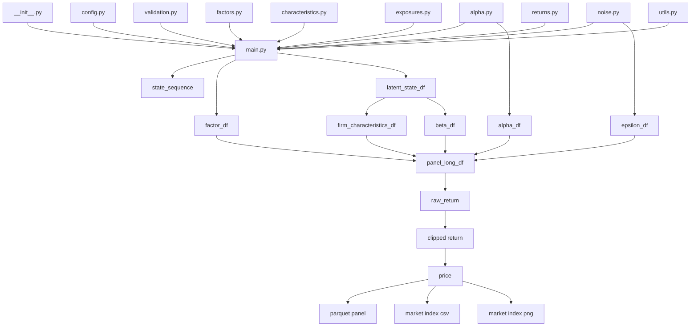

# Toy FF Generator `src` 架構技術文檔

這份文件提供 `toy_ff_generator/src/toy_ff_generator` 的開發者導向架構說明，聚焦目前程式的真實資料流、模組責任、輸入輸出、依賴關係與行為邊界。本文不重寫數學推導，僅說明程式如何把既有 DGP 規格落成實作。

## 1. 架構總覽

`toy_ff_generator` 是一個以函式式資料管線為核心的 toy data generator。整體設計可以拆成三層：

- 入口與 orchestration：`__init__.py`、`main.py`
- 純生成與轉換模組：`factors.py`、`characteristics.py`、`exposures.py`、`alpha.py`、`noise.py`、`returns.py`
- 共用支援模組：`config.py`、`validation.py`、`utils.py`

它的主流程是：

1. 建立或覆寫 config
2. 解析市場狀態序列 `state_sequence`
3. 驗證設定合法性
4. 生成 factor path
5. 生成 latent characteristic states
6. 由 latent state 建 observable characteristics
7. 由 latent state 建 beta exposures
8. 生成 stock-level alpha 與 idiosyncratic noise
9. 合併成 long panel
10. 計算 raw return、套用漲跌幅 clipping、遞推 price
11. 輸出 parquet panel 與 market index artifacts

### 1.1 套件入口

`__init__.py` 只暴露兩個主要對外接口：

- `run_simulation(...)`
- `run_batch_simulations(...)`

它採用 lazy import，避免在匯入套件時立刻載入 `main.py` 及其相依模組。這讓下列兩種使用方式都能共存：

- `import toy_ff_generator`
- `python -m toy_ff_generator.main`

### 1.2 主流程與模組依賴圖

### 1.3 模組角色摘要

| 模組 | 主要責任 | 核心輸出 |
| --- | --- | --- |
| `__init__.py` | 延後載入主流程並對外暴露 API | `run_simulation`, `run_batch_simulations` |
| `main.py` | 串接整個模擬流程與 batch orchestration | result dict / batch result list |
| `config.py` | 建立預設設定與 per-stock 預設 profile | config dict |
| `factors.py` | 生成 regime-dependent 3 維 FF factor path | `factor_df` |
| `characteristics.py` | 生成 latent state，並映射成 observable characteristics | `latent_state_df`, `firm_characteristics_df` |
| `exposures.py` | 將 latent state 線性映射為 beta exposures | `beta_df` |
| `alpha.py` | 由群組標籤決定固定 alpha 值 | `alpha_df` |
| `noise.py` | 由群組標籤決定 sigma 並抽樣 epsilon | `epsilon_df` |
| `returns.py` | 合併 panel、計算報酬、clipping、遞推價格 | enriched `panel_long_df` |
| `utils.py` | 共用工具與 artifact 輸出 / 重建 | paths、market index artifacts |
| `validation.py` | 驗證 config shape、群組、row count、covariance | 無，失敗時拋錯 |

## 2. 主流程設計

### 2.1 `main.py` 的 orchestration

`main.py` 是整個專案的控制中心，負責：

- 解析覆寫參數，例如 `output_dir`、`seed`、`N`、`T`、`S`、`dataset_count`
- 建立 `stock_ids` 與 `time_columns`
- 建立隨機數產生器 `np.random.Generator`
- 決定 `state_sequence`
- 在真正生成前呼叫 `validate_simulation_inputs(...)`
- 依序呼叫各生成模組並做 row-count / schema 驗證
- 將中間結果整理為最終 `panel_long_df`
- 呼叫 `save_outputs(...)` 寫出 artifacts

主流程核心函式是：

- `_run_simulation_from_config(...)`：單次模擬的完整實作
- `run_simulation(...)`：單次模擬公開入口
- `run_batch_simulations(...)`：多資料集 batch 公開入口

### 2.2 單次模擬的實際執行順序

`_run_simulation_from_config(...)` 的順序如下：

1. 讀出各設定區塊
2. 建 `stock_ids`、`time_columns`、`rng`
3. `_build_state_sequence(...)`
4. `validate_simulation_inputs(...)`
5. `generate_factors(...)`
6. `generate_latent_characteristic_states(...)`
7. `state_to_firm_characteristics(...)`
8. `generate_exposures(...)`
9. `generate_alpha(...)`
10. `generate_noise(...)`
11. `build_panel(...)`
12. `compute_raw_returns(...)`
13. `clip_returns(...)`
14. `generate_prices(...)`
15. 補上 `mu`、`alpha_group`、`epsilon_group`、`epsilon_variance`
16. `save_outputs(...)`

### 2.3 Batch mode

`run_batch_simulations(...)` 不是簡單的 for-loop 包裝，而是帶有監控機制的多進程 orchestrator。

它的行為重點如下：

- 以 `_build_dataset_config(...)` 對 base config 做逐 dataset seed 偏移
- 使用 `ProcessPoolExecutor` 平行生成多份 dataset
- 每個 worker 透過 `_run_single_dataset_batch(...)` 寫出 status snapshot JSON
- 父進程持續讀取 `_status/toy_ff_generator/dataset_*.json` 更新 dashboard
- 成功完成後會清除 `_status` 目錄；若失敗則保留狀態檔協助除錯

### 2.4 Worker 數量與記憶體估算

`main.py` 目前有一套保守的 worker 數量決策：

- 若 `batch_setup["max_workers"]` 為 `None`，先以 `min(cpu_count, dataset_count)` 為上限
- 嘗試從 `/proc/meminfo` 或 `os.sysconf(...)` 取得可用記憶體
- 用 `_estimate_worker_memory_bytes(...)` 估每個 worker 所需記憶體
- 預留至少 1GB 或可用記憶體的 35% 作為 reserve
- 最後以可用記憶體限制 worker 數量，避免過度併發造成 OOM

這代表 batch mode 的平行度不是只看 CPU，也會看 memory headroom。

## 3. 各模組架構說明

以下各節使用固定格式說明：模組責任、主要函式、輸入輸出、上下游依賴，以及目前實作特點或限制。

### 3.1 `__init__.py`

**模組責任**

- 作為套件入口包裝
- 以 lazy import 方式暴露主 API

**主要函式**

- `run_simulation(*args, **kwargs)`
- `run_batch_simulations(*args, **kwargs)`

**主要輸入 / 輸出**

- 輸入：轉交給 `main.py` 的任意參數
- 輸出：直接回傳 `main.run_simulation(...)` 或 `main.run_batch_simulations(...)` 的結果

**上游 / 下游**

- 上游：外部呼叫者
- 下游：`main.py`

**目前特點或限制**

- 本身不做任何驗證、資料生成或 I/O
- 目的純粹是減少 import side effect 並統一入口

### 3.2 `config.py`

**模組責任**

- 定義專案的預設 config 結構
- 建立 per-stock 預設 latent state / alpha / epsilon / initial price 配置
- 定義市場狀態常數與名稱對照

**主要函式 / 常數**

- `build_default_config()`
- `_default_per_stock_latent_state_params(n)`
- `_default_per_stock_alpha_epsilon_groups(n)`
- `_default_per_stock_initial_prices(n)`
- `STATE_ORDER`
- `STATE_NAME_MAP`

**主要輸入 / 輸出**

- 輸入：`N` 或預設規模
- 輸出：完整 config dict

**上游 / 下游**

- 上游：`main.py`、測試
- 下游：整個模擬流程都依賴其設定內容

**目前特點或限制**

- 預設 config 使用固定結構，沒有 schema class 或 dataclass
- 預設 per-stock profile 是 deterministic，不是隨機抽樣
- `mu_i` 由 low / mid / high 三類中心值組成固定 triplet
- `alpha_group`、`epsilon_group` 同時保留 shared fallback 與 per-stock 設定
- output 預設落在 `outputs/data v3/<state_name>`

### 3.3 `factors.py`

**模組責任**

- 生成 FF 三因子時間序列
- 把 `MKT`、`SMB`、`HML` 視為同一個 3 維向量 AR(1) 系統

**主要函式**

- `generate_factors(...)`
- `_resolve_regime_mean_vectors(...)`
- `_select_covariance_matrix(...)`
- `_select_regime_mean_vector(...)`

**主要輸入 / 輸出**

- 輸入：`state_sequence`、`X0`、`Phi`、`Sigma_X_*`、`mu_bear` / `mu_neutral` / `mu_bull`
- 輸出：`factor_df`
  - 主要欄位：`t`, `state`, `MKT`, `SMB`, `HML`

**上游 / 下游**

- 上游：`main.py` 提供已解析的市場狀態與 factor 參數
- 下游：`returns.py` 的 `build_panel(...)`

**目前特點或限制**

- 目前是真正的 regime-dependent 3 維向量 AR(1)，不是三條互相獨立的 AR(1)
- 仍保留舊版 `Delta` 相容路徑，但已標記 deprecated
- 每期會把 `state` 寫進 `factor_df`，後續 merge 到 panel

### 3.4 `characteristics.py`

**模組責任**

- 生成每檔股票、每期的 3 維 latent characteristic state
- 將 latent state 映射成 observable firm characteristics

**主要函式 / 常數**

- `generate_latent_characteristic_states(...)`
- `latent_to_firm_characteristics(...)`
- `state_to_firm_characteristics(...)`
- `LATENT_STATE_COLUMNS`
- `FIRM_CHARACTERISTIC_COLUMNS`

**主要輸入 / 輸出**

- 輸入：`stock_ids`、`time_columns`、`state_sequence`
- shared 模式輸入：`Omega`, `mu_Z`, `lambda_Z`, `sigma_Z`, `Z0`
- per-stock 模式輸入：`Omega_i`, `mu_i`, `lambda_i`, `sigma_Z_i`, `Z0_i`
- 輸出 1：`latent_state_df`
  - 欄位：`stock_id`, `t`, `latent_characteristic_1_state`, `latent_characteristic_2_state`, `latent_characteristic_3_state`
- 輸出 2：`firm_characteristics_df`
  - 欄位：`stock_id`, `t`, `characteristic_1`, `characteristic_2`, `characteristic_3`

**上游 / 下游**

- 上游：`main.py`、`config.py`
- 下游：`exposures.py`、`returns.py`

**目前特點或限制**

- observable characteristic 目前是 latent state 的一對一複製，不做非線性轉換或 `exp(...)`
- shared 與 per-stock 模式的遞迴形式不同：
  - shared：`mu + Omega * (previous - mu) + lambda * state + innovation`
  - per-stock：`Omega * previous + mu + lambda * state + innovation`
- latent state noise 目前是逐維獨立常態抽樣，使用 diagonal scale 而非完整共變矩陣

### 3.5 `exposures.py`

**模組責任**

- 把 latent state 映射成 FF-style beta exposures

**主要函式**

- `generate_exposures(...)`

**主要輸入 / 輸出**

- 輸入：`latent_state_df`、`A`、`b`
- 輸出：`beta_df`
  - 欄位：`stock_id`, `t`, `beta_mkt`, `beta_smb`, `beta_hml`

**上游 / 下游**

- 上游：`characteristics.py` 產出的 `latent_state_df`
- 下游：`returns.py` 的 `build_panel(...)`

**目前特點或限制**

- 實作是線性映射 `beta = A @ Z + b`
- `A` 與 `b` 都被強制檢查為 3 維對應 shape
- 目前沒有更複雜的非線性 exposure function

### 3.6 `alpha.py`

**模組責任**

- 依 alpha group 產生每檔股票固定 alpha

**主要函式**

- `resolve_alpha_value(...)`
- `generate_alpha(...)`

**主要輸入 / 輸出**

- 輸入：`stock_ids`、`alpha_group`、`alpha_levels`、可選的 `per_stock_alpha_groups`
- 輸出：`alpha_df`
  - 欄位：`stock_id`, `alpha`

**上游 / 下游**

- 上游：`main.py`、`config.py`
- 下游：`returns.py` 的 `build_panel(...)`

**目前特點或限制**

- 這一層是 group-to-value 映射，不是逐股票自由抽樣
- 若提供 `per_stock_alpha_groups`，則 shared `alpha_group` 只作 fallback 概念

### 3.7 `noise.py`

**模組責任**

- 依 epsilon group 決定每檔股票的 sigma，並生成 idiosyncratic noise

**主要函式**

- `resolve_epsilon_sigma(...)`
- `generate_noise(...)`

**主要輸入 / 輸出**

- 輸入：`stock_ids`、`time_columns`、`epsilon_group`、`epsilon_levels`、`rng`
- 可選輸入：`per_stock_epsilon_groups`
- 輸出：`epsilon_df`
  - 欄位：`stock_id`, `t`, `epsilon`

**上游 / 下游**

- 上游：`main.py`、`config.py`
- 下游：`returns.py` 的 `build_panel(...)`

**目前特點或限制**

- 也是 group-to-value 映射，不是直接傳入完整 `sigma_epsilon_i` 向量 API
- shared 模式下所有股票共用同一 sigma
- per-stock 模式下每檔股票在所有時間點共用固定 sigma，但每期重新抽樣 epsilon

### 3.8 `returns.py`

**模組責任**

- 將各模組輸出合併成 long panel
- 依模型方程式計算 raw return
- 對 raw return 套用上下限 clipping
- 依 clipped return 遞推價格

**主要函式**

- `build_panel(...)`
- `compute_raw_returns(...)`
- `clip_returns(...)`
- `generate_prices(...)`

**主要輸入 / 輸出**

- `build_panel(...)` 輸入：`firm_characteristics_df`, `beta_df`, `alpha_df`, `epsilon_df`, `factor_df`
- `build_panel(...)` 輸出：基礎 `panel_df`
- `compute_raw_returns(...)` 輸出：新增 `raw_return`
- `clip_returns(...)` 輸出：新增 `return`
- `generate_prices(...)` 輸出：新增 `price`

**上游 / 下游**

- 上游：`characteristics.py`、`exposures.py`、`alpha.py`、`noise.py`、`factors.py`
- 下游：`main.py` 最終整理與 `utils.py` 輸出

**目前特點或限制**

- 報酬方程式是 contemporaneously aligned：
  `alpha + beta_mkt*MKT + beta_smb*SMB + beta_hml*HML + epsilon`
- `clip_returns(...)` 只對 `raw_return` 做上下限裁切，不改變其他欄位
- `generate_prices(...)` 預設優先走 dense panel 的向量化路徑，否則 fallback 到逐 stock recursion

### 3.9 `utils.py`

**模組責任**

- 提供共用工具函式
- 負責輸出 artifacts
- 提供由 panel 重建 market index artifacts 的實用工具

**主要函式**

- `set_random_seed(...)`
- `make_stock_ids(...)`
- `make_time_columns(...)`
- `ensure_output_dir(...)`
- `prepare_panel_long_for_parquet(...)`
- `build_market_index_df(...)`
- `save_outputs(...)`
- `rebuild_market_index_artifacts_from_panel_frame(...)`
- `rebuild_market_index_artifacts_from_panel_path(...)`

**主要輸入 / 輸出**

- 輸入：最終 `panel_long_df` 與輸出路徑
- 輸出：
  - parquet：`*_PL.parquet`
  - csv：`*_market_index.csv`
  - png：`summary/*_market_index.png`
  - `output_paths` dict

**上游 / 下游**

- 上游：`main.py`
- 下游：檔案系統；測試也直接使用重建工具

**目前特點或限制**

- `save_outputs(...)` 目前只寫三種 artifact：
  - panel parquet
  - market index csv
  - market index png
- `output_paths` 仍保留下列 keys，但目前一律為 `None`：
  - `prices`
  - `returns`
  - `metadata`
  - `excel_workbook`
- `prepare_panel_long_for_parquet(...)` 會把 `t` 從 `t_0` 這種字串轉成整數 index
- market index 圖會同時畫平均價格路徑與三因子路徑
- 寫檔採 atomic write 風格，先寫臨時檔再 `os.replace(...)`

### 3.10 `validation.py`

**模組責任**

- 作為 config 與中間資料的防線
- 在資料生成前或模組輸出後，盡早攔截 shape / schema / group / covariance 問題

**主要函式**

- `validate_simulation_inputs(...)`
- `validate_market_state_setup(...)`
- `validate_factor_setup(...)`
- `validate_latent_characteristic_setup(...)`
- `validate_exposure_setup(...)`
- `validate_alpha_epsilon_mode_setup(...)`
- `validate_clipping_price_setup(...)`
- `validate_latent_state_df(...)`
- `validate_firm_characteristics_df(...)`
- `validate_beta_df(...)`
- `validate_component_row_count(...)`
- `validate_panel_row_count(...)`

**主要輸入 / 輸出**

- 輸入：config 各子區塊與中間 DataFrame
- 輸出：無；若違規則拋出 `ValueError`

**上游 / 下游**

- 上游：`main.py`
- 下游：無，屬於 guardrail 模組

**目前特點或限制**

- 會驗證 covariance matrix 是否對稱且半正定
- 會驗證 `state_sequence`、群組標籤、shared/per-stock shape
- 會驗證輸出 DataFrame 必要欄位與 row count
- 這一層偏向 schema / shape / basic numeric sanity，並不驗證經濟意義上的數值品質

### 3.11 `main.py`

**模組責任**

- 整合整個生成流程
- 封裝單次與 batch 模擬入口
- 管理輸出檔名、狀態檔與 batch dashboard

**主要函式**

- `run_simulation(...)`
- `run_batch_simulations(...)`
- `_run_simulation_from_config(...)`
- `_run_single_dataset_batch(...)`
- `_resolve_max_workers(...)`
- `cleanup_stale_completed_status_dir(...)`

**主要輸入 / 輸出**

- 輸入：config 或 runtime override 參數
- 單次輸出：result dict，包含 config、各中間 DataFrame、`output_paths`
- batch 輸出：依 `dataset_number` 排序的 result dict list

**上游 / 下游**

- 上游：`__init__.py`、直接 CLI / import 使用者
- 下游：所有其他模組

**目前特點或限制**

- 對外最主要的流程接口都集中在這個檔案
- 檔名命名規則依 state / N / T / dataset number 自動生成
- `panel_long_df["epsilon_variance"]` 目前實際存的是 epsilon sigma 設定值，不是平方後的 variance；欄位名保留是為了向後相容

## 4. 對外接口與 artifact contract

目前最重要的公開接口如下：

- `run_simulation(...)`
  - 單次產生一份 dataset
- `run_batch_simulations(...)`
  - 產生多份 dataset，支援平行 worker 與 status snapshot
- `build_default_config()`
  - 取得目前程式可接受的完整預設設定
- `rebuild_market_index_artifacts_from_panel_path(...)`
  - 已有 parquet panel 時，重建 market index csv 與 png

### 4.1 單次 / batch 回傳值

單次 result dict 會包含：

- `config`
- `state_sequence`
- `factor_df`
- `latent_state_df`
- `firm_characteristics_df`
- `beta_df`
- `alpha_df`
- `epsilon_df`
- `panel_long_df`
- `output_paths`

batch result 會回傳上述資訊的摘要版本，並附上：

- `dataset_number`
- `run_seed`
- `status_path`
- `batch_run_id`
- `elapsed_seconds`

### 4.2 Artifact contract

目前會真正落地的 artifacts 只有三種：

- `*_PL.parquet`
- `*_market_index.csv`
- `summary/*_market_index.png`

`output_paths` 中下列 keys 雖仍保留，但目前實作不輸出對應檔案，因此值為 `None`：

- `prices`
- `returns`
- `metadata`
- `excel_workbook`

### 4.3 命名規則

檔名中的 state token 取決於 `_format_state_for_filename(...)`：

- 若整段只有單一 state，使用 `bear` / `neutral` / `bull`
- 若是手動指定多狀態 sequence，使用 `sequence`
- 若是由 Markov transition 生成，使用 `markov`

panel 命名示意：

- 單次：`bull_12_6_PL.parquet`
- batch：`bull_12_6_PL_1.parquet`

market index 命名示意：

- 單次：`bull_12_6_market_index.csv`
- batch：`bull_12_6_market_index_1.csv`

## 5. 已知行為邊界與實作事實

這裡列出最容易被誤解，但目前程式行為已固定的地方：

- `characteristics.py` 的 observable characteristics 目前不是轉換後特徵，而是 latent state 原樣複製
- `exposures.py` 目前只有線性 mapping，沒有 nonlinear beta function
- `alpha.py` 與 `noise.py` 是群組映射層，不是通用自由參數抽樣器
- `returns.py` 採當期因子與當期 beta 對齊計算 return
- `utils.py` 目前不產出 wide `price.csv`、wide `return.csv`、`metadata.json` 或 Excel workbook
- `epsilon_variance` 欄位名稱有歷史包袱，內容其實是 sigma，不是 variance

